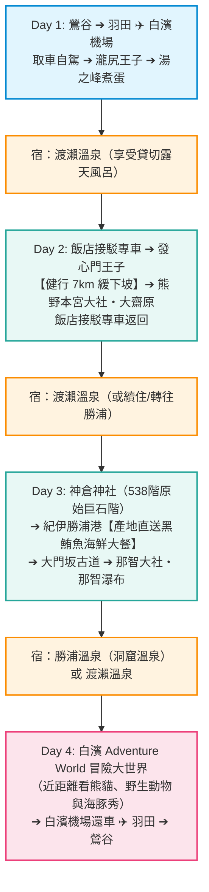

# 🌲 熊野古道（中邊路）雙人 4 天 3 夜深度漫遊企劃

> **出發地點**：東京・鶯谷站  
> **交通方式**：羽田機場往返南紀白濱機場（JAL）＋ 白濱機場租車自駕（Fly & Drive）  
> **核心住宿**：渡瀨溫泉（わたらせ温泉 ホテルささゆり）  
> **主要亮點**：
> * 飯店免費專車接駁健行：**發心門王子 ➔ 熊野本宮大社**（中邊路最精華 7km 緩下坡）
> * 古道巨木參道與靈驗名瀑：**大門坂 ➔ 熊野那智大社 ➔ 那智瀑布**
> * 日本第一生鮮黑鮪魚海港：**紀伊勝浦港（勝浦漁港にぎわい市場）**
> * 白濱機場旁超人氣主題樂園：**冒險大世界（Adventure World，看熊貓、野生動物園與海豚秀）**
> * 享受西日本最大露天風呂與無限次免費獨立貸切私湯

---

## 🌸 出發時間與氣候評估（在日居民專屬・防花粉與避雨避雪攻略）

> 💡 **核心結論**：對於**長住在日本（鶯谷出發）**的旅客，**唯一強烈推薦出發區間為：【4 月 10 日 ～ 4 月 22 日】**！

### 🔍 2月～4月氣候與「在日生活防花粉」深度解析

| 月份／旬 | 降雪・結冰風險 | 降雨風險（氣象廳數據） | 🌲 花粉危險度（在日居民必讀） | 綜合評估與建議 |
| :--- | :---: | :---: | :---: | :--- |
| **2 月全月** | ⚠️ **有降雪/結霜薄冰** | 降雨量雖少，但易凍結 | 🟡 飛散初期（中低） | ❌ **不推薦**：早晨低溫破 0℃，大門坂等青苔石階結薄冰（黑冰）極滑危險。 |
| **3 月上旬** | ⚪ 極低（清晨微凍） | 晴朗穩定率高 | 🔴 **柳杉（スギ）大爆發** | ❌ **極度危險**：熊野古道全線為紀州柳杉林，深呼吸會大量吸入花粉。 |
| **3 月中旬** | 🟢 完全無雪無霜 | 降雨量適中 | 🔴 **柳杉（スギ）最高峰** | ❌ **在日居民大忌**：原本沒花粉症的人，極易在此被大量花粉灌爆水杯，誘發終生花粉症！ |
| **3 月下旬** | 🟢 無雪 | ⚠️ **菜種梅雨（易連日陰雨）** | 🟠 柳杉尾聲＋春雨泥濘 | ❌ **不推薦**：梅雨鋒面前奏，天雨路滑且仍有花粉殘留。 |
| **4 月上旬** | 🟢 無雪 | ⚠️ 春季對流雨頻繁 | 🟠 換**檜木（ヒノキ）**接力 | ⚠️ **普通**：對扁柏/檜木敏感者仍有症狀，且春雨多變。 |
| **4 月中旬 (4/10~4/22)** | 🟢 **完全無雪無結冰** | 🟢 **鋒面間隔晴朗期** | 🟢 **【安全期】柳杉歸零、檜木微量** | 🌟 **★★★★★ 最完美黃金週**：保護水杯不爆、氣溫舒適（18~21℃）、避開黃金週人潮。 |
| **4 月下旬** | 🟢 無雪 | 降雨機率略增 | 🟢 花粉全面平息 | ❌ **遇日本黃金週（4/29起）**：房價翻倍、車票難搶、看熊貓人擠人。 |

#### 🚨 為什麼長住日本千萬不能在 3 月去走熊野古道？
1. **「免疫水杯」累積效應**：生活在東京，每年春天即使尚未出現花粉症，體內早已持續累積致敏抗體（水杯可能已有 60~70% 滿）。
2. **健行換氣量的致命打擊**：熊野古道是日本著名柳杉人工林大本營。3 月是柳杉花粉最極致的高峰期，在山區劇烈運動、深呼吸長達 3~5 小時，吸入花粉量是平時都市生活的數十倍，**極易成為「壓垮駱駝的最後一根稻草」，從此變成每年春天都痛苦的終生花粉症體質**！
3. **4 月中旬是安全天堂**：到了 4 月 10 日之後，柳杉花粉已完全釋放完畢，檜木花粉也進入尾聲，此時進入山林才是最安全、最舒適的時機。

---

## 🗺️ 總覽行程地圖與動線

---

## ⏱️ 每日詳細行程規劃

### 📅 Day 1：啟程靈場・飛向和歌山 ➔ 取車入山・初探古道秘湯

*   **06:15 鶯谷站出發**
    *   搭乘 JR 京濱東北線/山手線至「濱松町站」（約 14 分鐘），轉乘東京單軌電車機場快速（約 13 分鐘），**06:55 抵達羽田機場第 1 航廈**。
*   **07:45 - 08:55 搭乘 JAL 213 航班（羽田 ➔ 南紀白濱）**
    *   飛行時間僅 1 小時 10 分鐘，沿途可俯瞰富士山與紀伊半島海岸線。
*   **09:15 - 09:40 白濱機場取車**
    *   出關後直接在航廈櫃檯取車（推薦 Toyota、Times 或 Orix 的小型掀背車 Compact 級）。
*   **09:45 - 10:30 開車前往熊野古道入口【瀧尻王子】**（國道 311 號，車程約 40 分鐘）
    *   參觀**熊野古道館**，領取中邊路蓋章小手冊（押印帳）與健行地圖。
    *   在瀧尻王子神社參拜，此處為古道聖域的起點，富田川與岩田川交會處風景清幽。
    *   *彈性開車走訪*：開車上山至「高原 霧之鄉」，俯瞰梯田山谷景致並享用農家時令野菜午餐。
*   **14:00 - 15:30 順路探訪【湯之峰溫泉】（車程約 25 分鐘）**
    *   在溫泉湧出口「湯筒（Yuzutsu）」旁小販買雞蛋與蔬菜，放進 90°C 的天然溫泉水中煮溫泉蛋。
    *   朝聖世界唯一可入浴的世界遺產「つぼ湯（壺湯）」，感受江戶時代老街氣氛。
*   **16:00 抵達【渡瀨溫泉 ホテルささゆり】Check-in**
    *   **重要步驟**：在櫃檯辦理入住時，**向服務人員預約登記「明日早晨前往發心門王子」與「下午從本宮大社接回」的免費專車**。
    *   **晚間享受**：先去體驗渡瀨溫泉最具特色的數座獨立大「貸切露天風呂（家庭私湯）」，兩個人獨享山林私密湯池；晚餐品嚐紀州山海會席料理。

---

### 📅 Day 2：免開車超輕鬆！飯店專車接駁 ➔ 中邊路最精華段健行 ➔ 本宮大社

> **今日亮點**：完全不用煩惱開車與停車問題！飯店專車送上山、專車接回，無痛完成熊野古道中邊路最熱門的「黃金散步道」。

*   **07:30 - 08:30 飯店悠閒早餐**，整理輕便一日攻頂小背包（裝水、毛巾、雨具、相機）。
*   **08:45 搭乘渡瀨溫泉專用接駁巴士出發**
    *   專車直接送至健行起點**【發心門王子】**（車程約 20 分鐘）。
*   **09:15 - 12:30 【中邊路黃金健行：發心門王子 ➔ 熊野本宮大社】**
    *   **距離**：約 7 公里
    *   **預估時間**：2.5 ～ 3 小時
    *   **難度**：★☆☆☆☆（初級，幾乎全路段為微下坡與平坦碎石/石疊步道，極度好走）
    *   **沿途精華**：
        1.  **發心門王子**：神聖領域的「發菩提心之門」，巨型鳥居立於杉木林間。
        2.  **水飲王子**：古時旅人解渴的天然湧泉遺跡。
        3.  **里山茶園風景**：步道穿越純樸的山間農村，兩側種滿紀州茶園，秋季芒草、春季山櫻，風景開闊宜人。
        4.  **伏拜王子**：古人長途跋涉數日，在此首次遠眺到熊野本宮大社的森林屋頂，激動地伏地跪拜因而得名。此處有茶屋可稍作休息、喝杯熱茶。
        5.  **三軒茶屋舊跡**：高野山參拜道與中邊路的交會歷史十字路口。
        6.  **祓殿王子**：在正式進入神聖大殿前的淨身洗塵之所。
*   **12:30 - 14:00 抵達【熊野本宮大社】與午餐**
    *   參拜熊野信仰的核心總本山，參道兩側滿插八咫烏神旗。
    *   在神社門前的門前町享用和歌山特色美食：**「めはり壽司（目張壽司）」**（用高菜葉包裹的香噴噴飯糰）或手工山藥蕎麥麵。
*   **14:00 - 15:00 朝聖【大齋原（日本第一大鳥居）】**
    *   步行 5 分鐘穿過綠意盎然的稻田，來到本宮大社的原始舊址「大齋原」。
    *   仰望高達 34 公尺、日本最巨大的鋼筋混凝土大鳥居，感受群山與音無川環抱的宏大氣場。
*   **15:15 搭乘飯店預約好的接駁專車回到渡瀨溫泉**
    *   司機於約定地點（通常在大社前或世界遺產遺產中心旁）接駁，5 分鐘直接送回飯店門口！
*   **下午與晚間**：
    *   健行完洗去汗水，換上浴衣享受西日本最大級的大露天風呂，徹底放鬆雙腿肌肉。
*   **宿**：渡瀨溫泉（連住第 2 晚，完全不用每天打包行李）。

---

### 📅 Day 3：朝聖海之靈場 ➔ 紀伊勝浦港產地黑鮪魚 ➔ 大門坂古道與那智瀑布

*   **08:30 退房出發**，沿著風景優美的熊野川（國道 168 號）開往太平洋岸的新宮市（約 40 分鐘）。
*   **09:20 - 10:40 挑戰震撼秘境【神倉神社】（新宮市）**
    *   登山口在懸崖之下，挑戰由天然巨石壘砌的 **538 階原始陡峭石階**。
    *   登上山頂朝拜熊野諸神最初降臨的巨大神石「琴引岩（ゴトビキ岩）」，從懸崖上俯瞰新宮市街與湛藍的太平洋，視野震撼絕倫。
    *   *順遊*：開車 5 分鐘參拜擁有鮮艷朱紅神殿的「熊野速玉大社」。
*   **11:20 - 12:45 前往【紀伊勝浦港】享用極品生鮮黑鮪魚海鮮午餐**（車程約 25 分鐘）
    *   勝浦港是全日本「生鮮（未冷凍）黑鮪魚延繩釣」捕獲量第一的港口。
    *   **推薦地點**：**「勝浦漁港 にぎわい市場（熱鬧市場）」**
        *   坐在碼頭邊吹海風，享用油脂豐富的黑鮪魚大腹/中腹刺身丼、新鮮現烤扇貝、海膽壽司。
        *   運氣好還能近距離看到師傅精湛的現場解體秀！
*   **13:00 - 16:00 開車前往【大門坂】與【熊野那智大社】**（車程約 15 分鐘）
    *   **停車點**：車停在「大門坂免費公共停車場」。
    *   **健行段**：
        1.  踏入**大門坂**：走進古老石疊參道，兩側是樹齡逾 800 年的參天「夫妻杉」，氣氛莊嚴古樸。
        2.  登石階而上參拜**【熊野那智大社】**與一旁的**【那智山青岸渡寺】**。
        3.  來到青岸渡寺三重塔前，拍攝全日本最經典的「三重塔＋背景那智瀑布」明信片取景畫面。
        4.  順步道走下至**【那智瀑布・飛瀧神社】**，站在日本落差最大（133m）的瀑布神殿前，感受水氣撲面的神聖震撼。
    *   **下山方式**：在瀑布前搭乘在地公車（約 7 分鐘）輕鬆滑回大門坂停車場取車（不用走回頭路爬階梯）。
*   **晚間住宿選擇（建議二選一）**：
    *   **選擇 A（強烈推薦）**：**宿勝浦港【浦島飯店 Hotel Urashima】**（車停勝浦港碼頭，搭專用小船前往），在天然海蝕洞穴「忘歸洞」邊泡溫泉邊聽太平洋海浪拍打岩壁，晚上再吃一頓海鮮盛宴。
    *   **選擇 B**：開車 45 分鐘返回渡瀨溫泉續住第 3 晚（省去更換飯店的麻煩）。

---

### 📅 Day 4：近距離看熊貓與海洋樂園！【Adventure World】➔ 滿載而歸返京

*   **08:30 - 10:00 啟程前往白濱**
    *   若從勝浦出發：走國道 42 號海岸線，沿途可短暫停留「串本・橋杭岩」（海上奇石陣）拍照，開車約 1 小時 20 分抵達白濱。
    *   若從渡瀨溫泉出發：走國道 311 號約 1 小時抵達白濱。
*   **10:00 - 15:30 【白濱冒險世界 Adventure World（アドベンチャーワールド）】**
    *   **地理位置絕佳**：就在**南紀白濱機場跑道正旁邊**（開車只要 3~5 分鐘）！
    *   **必看四大亮點**：
        1.  **大熊貓館（Panda Love & 繁殖中心）**：日本規模數一數二的熊貓培育基地，排隊人潮遠少於上野動物園，能超近距離觀察大熊貓啃竹子、翻滾玩耍的可愛模樣。
        2.  **野生動物園（Safari World）**：免費搭乘園區雙層遊園小火車（Kenya 号），穿梭在獅子、白虎、非洲象、長頸鹿的身邊；也可選擇租高爾夫球車或徒步探險餵食。
        3.  **Marine Live 海洋現場秀**：在背靠群山的大型露天海豚水槽，欣賞數十隻海豚在動人配樂下騰空躍起的高水準表演。
        4.  **海獸與企鵝館**：成群企鵝在雪地上列隊漫步。
    *   **午餐**：在園區內享用超可愛的熊貓造型咖哩飯或特色漢堡。
*   **15:45 - 16:45 白濱海岸名勝巡禮（自由選配）**
    *   開車 8 分鐘到白濱海岸邊，欣賞壯麗的海蝕斷崖**【三段壁】**與廣大的海蝕階地**【千疊敷】**。
    *   或到附近的「Toretore 市場（とれとれ市場）」做最後衝刺，採購紀州特產頂級南高梅乾與和歌山橘子伴手禮。
*   **16:50 抵達白濱機場租車門市還車**
    *   還車後由租車公司接駁或步行 2 分鐘回到航廈。
*   **18:25 - 19:40 搭乘 JAL 218 航班飛往羽田機場**
*   **20:45 返抵鶯谷站**，平安圓滿結束熊野古道心靈與大自然療癒之旅！

---

## 💰 預算費用預估表（雙人同行）

| 項目 | 細節說明 | 2 人預算合計 (日幣) |
| :--- | :--- | :--- |
| **機票（JAL）** | 羽田 ⇄ 白濱（提前訂購 Special Saver 特便票） | 約 ¥44,000 ~ ¥55,000 |
| **租車（4 天）** | 小型車（Compact）4天＋全險＋油資＋ETC過路費 | 約 ¥32,000 ~ ¥36,000 |
| **住宿（3 晚）** | 渡瀨溫泉ささゆり 2 晚（**實查精確價 ¥118,800**）＋ 勝浦 1 晚（約 ¥36,000）（均含早晚餐一泊二食） | 約 ¥154,800 |
| **門票與公車** | Adventure World 門票（¥5,300/人）＋ 那智下山公車 | 約 ¥12,000 |
| **餐飲與雜項** | 勝浦黑鮪魚海鮮午餐、市場伴手禮、特色小吃等 | 約 ¥22,000 |
| **總計（2人）** | **精緻舒適・高品質溫泉與山海行（精準校準版）** | **約 ¥270,800** *(每人約 ¥135,400 / 折合台幣約 2.8 萬元)* |

---

## 🎒 健行裝備與出發前必知 Tips

1.  **渡瀨溫泉接駁車預約**：
    *   入住當天下午辦理 Check-in 時，請立刻在櫃檯向工作人員登記隔天早上去「發心門王子」的接駁名額，並約定好下午本宮大社回程的班次。
2.  **健行鞋與防滑防雨**：
    *   Day 2 的發心門王子到本宮大社非常平緩好走，穿一般具防滑功能的慢跑健行鞋即可；但 Day 3 的神倉神社石階非常陡峭原始、大門坂石階若遇露水容易濕滑，**強烈建議穿著抓地力好、防滑的登山健行鞋**，並隨身攜帶輕量雨衣與一支折疊登山杖。
3.  **Adventure World 休園日確認**：
    *   冒險大世界通常每週**星期三**為常態休園日（若適逢日本連假或寒暑假則可能營業）。安排行程時務必提前在[官網日曆](https://www.aws-s.com/)核對，若 Day 4 剛好碰上休園，可將 Day 4 與 Day 1 行程對調。
4.  **行李完全零煩惱**：
    *   全程有租車，26~29 吋大行李箱直接放後車廂，健行時只要背隨身攻頂小包，完全不需要花錢使用每天託運行李的接送服務！
