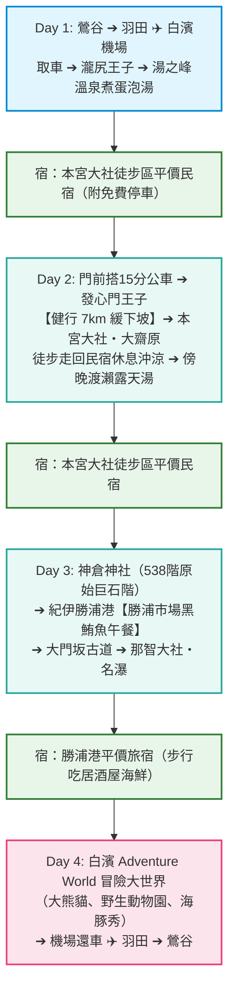

# 🌲 熊野古道（中邊路）4 天 3 夜雙人健行企劃【經濟實惠方案】

> **出發地點**：東京・鶯谷站  
> **交通方式**：羽田機場往返南紀白濱機場（JAL）＋ 白濱機場租車自駕（Fly & Drive）  
> **核心住宿**：**熊野本宮大社徒步區精選平價民宿 / Guesthouse（附設免費專屬停車位）**  
> **線上互動網頁**：[https://debbiexdd.github.io/Kumano-Junior-/economy.html](https://debbiexdd.github.io/Kumano-Junior-/economy.html)  
> *(與【極致放鬆方案】相比，行程內容完全相同，僅更換住宿模式，**雙人現省約 ¥114,800 日圓**！)*

---

## 🌟 經濟實惠方案的四大聰明特色

1. **🏡 住在本宮大社旁，節省巨大開銷**：
   * 避開昂貴的溫泉旅館會席包套（渡瀨溫泉ささゆり 2 晚需 ¥118,800）。
   * 改住本宮大社正門前或步行 10 分鐘內的優質乾淨民宿（如 **B&B Cafe ほんぐう**、**旅人の宿 蒼空**、**ゲストハウス 結**），**雙人 2 晚僅約 ¥24,000 ～ ¥30,000**！
   * 全數精選**自帶免費專屬停車位**的民宿，租車自駕停放零煩惱。
2. **🥾 健行動線自主度 100 分**：
   * 早上悠閒走出民宿，步行 2 分鐘到大社前公車站，搭乘 15 分鐘在地公車（車資僅 ¥470/人）直達「發心門王子」。
   * 一路漫步 7 公里平緩下坡抵達熊野本宮大社與大齋原，**直接走回自己的民宿沖澡換衣服**，完全不受飯店專車接駁時間限制！
3. **♨️ 當地人的「日歸泡湯」玩法**：
   * 雖然不住溫泉大飯店，但因有租車，隨時可開車 5～8 分鐘享受三大名湯：
     * **湯之峰溫泉**：在湯筒煮溫泉蛋，花 ¥400～¥800 泡世界遺產「つぼ湯」或公眾浴場。
     * **渡瀨溫泉**：花 ¥1,000 門票進入西日本最大級的露天大浴場暢泡。
     * **川湯溫泉**（若 2 月底前往）：跳進全日本唯一的天然河川「仙人風呂」（完全免費！）。
4. **🐟 黑鮪魚與冒險世界照樣全制霸**：
   * 第 3 天前往紀伊勝浦港吃日本第一生鮮黑鮪魚刺身與海鮮丼，走大門坂古道朝聖那智名瀑。
   * 第 4 天在機場旁冒險大世界（Adventure World）看大熊貓、野生動物園與海豚秀。

---

## 🏡 精選平價住宿推薦（本宮大社徒步圈・附免費停車場）

### 1. B&B Cafe ほんぐう (B&B Cafe Hongu)
* **位置**：熊野本宮大社正前方，**步行 1 分鐘**！門口即是公車站與門前町。
* **停車**：附設房客免費專屬停車場。
* **特色**：1 樓為氣氛溫馨悠閒的文青咖啡館，2 樓為乾淨舒適的和洋客房。晨間散步幾步路就能到大社參拜，清靜無人。
* **預估房價**：雙人 2 晚約 **¥26,000 ～ ¥32,000**。

### 2. 旅人の宿 蒼空 げすとはうす (Sora Guesthouse)
* **位置**：距離熊野本宮大社步行約 10~15 分鐘（開車 2 分鐘）。
* **停車**：附設免費專用停車場。
* **特色**：**全室皆附設獨立私人衛浴與獨立洗手間**！注重隱私的首選。館內有投幣式洗衣機、烘衣機與小廚房，歐美徒步客極高評價。
* **預估房價**：雙人 2 晚約 **¥24,000 ～ ¥30,000**。

### 3. ゲストハウス 結 -Yui- (Guesthouse Yui)
* **位置**：距離熊野本宮大社步行約 10 分鐘，坐落於視野極佳的高台上。
* **停車**：附設免費寬敞停車場。
* **特色**：陽台可直接遠眺大齋原的日本第一大鳥居！設有設備齊全的公共廚房可自炊料理，老闆親切熱情。
* **預估房價**：雙人 2 晚約 **¥22,000 ～ ¥28,000**。

### 4. 第 3 晚勝浦港推薦：WhyKumano Hostel & Cafe Bar 或 Hotel Charmant
* **位置**：距離勝浦漁港與魚市場步行 3 分鐘，附設免費停車位。
* **預估房價**：雙人 1 晚約 **¥10,000 ～ ¥13,000**（相比浦島飯店省下約 ¥23,000）。

---

## ⏱️ 每日詳細行程規劃

### 📅 Day 1：啟程靈場・初探古道 ➔ 湯之峰日歸泡湯 ➔ 入住本宮民宿
* **06:15** 鶯谷出發 ➔ 07:05 抵達羽田機場第 1 航廈。
* **07:45 - 08:55** 搭乘 JAL 213 航班飛往南紀白濱機場。
* **09:20** 機場大廳取車（Compact 級小型掀背車），行李丟後車廂。
* **10:15 - 13:00** 開車至熊野古道起點**【瀧尻王子】**與「熊野古道館」；上行至「高原 霧之鄉」俯瞰群山梯田並享用午餐。
* **14:00 - 15:30** 開車前往**【湯之峰溫泉】**：
  * 在湯筒買雞蛋蔬菜煮天然溫泉蛋。
  * 自費體驗世界遺產「つぼ湯（壺湯 ¥800）」或百年公眾浴場（¥400），感受最濃烈的硫磺古湯。
* **16:30** 開車 5 分鐘抵達本宮大社，辦理民宿入住（車停免費停車位）。
* **晚間**：漫步在門前町，於在地食堂品嚐熱騰騰的鄉土蕎麥麵或定食。
* **宿**：B&B Cafe ほんぐう / 旅人の宿 蒼空 / ゲストハウス 結。

### 📅 Day 2：超自由自主健行！公車上山 ➔ 漫步 7km 下山直達民宿
* **08:00** 在民宿享用早餐或外帶咖啡麵包。
* **09:05** 步行 2 分鐘到「本宮大社前」公車站，搭乘龍神巴士（約 15 分鐘，車資 ¥470/人）直達**【發心門王子】**。
* **09:25 - 12:30** **【中邊路黃金健行 7km 緩下坡】**：
  * 發心門王子 ➔ 水飲王子 ➔ 伏拜王子（遠眺大社屋頂）➔ 三軒茶屋 ➔ 熊野本宮大社。
  * 全程為優美平緩的林間小徑與農村茶園，無劇烈爬坡，初級好走。
* **12:30 - 14:30** 步道終點直達**【熊野本宮大社】**，參拜主殿、享用名物「めはり壽司」，穿過田野參拜**【大齋原（日本最大鳥居）】**。
* **14:45** **徒步幾分鐘直接走回自己的民宿！** 沖熱水澡、更換乾淨衣物，自由度滿分。
* **16:30** 開車 8 分鐘到隔壁的**渡瀨溫泉**，買日歸溫泉票（¥1,000/人），享受西日本最大級的露天風呂大浴場！
* **宿**：本宮大社周邊民宿（連住第 2 晚，大行李不用打包搬移）。

### 📅 Day 3：海之靈場・勝浦黑鮪魚・大門坂古道與那智瀑布
* **08:30** 退房出發，沿熊野川開往新宮市（約 40 分鐘）。
* **09:20 - 10:45** 挑戰**【神倉神社】**（攀登 538 階原始陡峭巨石階，參拜峭壁巨石「琴引岩」，俯瞰太平洋）。
* **11:30 - 12:45** 前往**【紀伊勝浦港】**，在「勝浦漁港 にぎわい市場」大啖日本第一生鮮黑鮪魚中腹丼、握壽司與現烤海鮮！
* **13:15 - 16:00** 前往**【大門坂】**免費停車場，漫步 800 年夫妻杉青苔石疊古道，參拜熊野那智大社、青岸渡寺，觀賞落差 133 米的那智瀑布（飛瀧神社）。搭 7 分鐘公車回停車場取車。
* **16:45** 入住勝浦港周邊平價旅宿（如 WhyKumano 或 Hotel Charmant），晚上在港邊居酒屋品嚐地酒與海鮮。
* **宿**：勝浦港周邊平價旅宿。

### 📅 Day 4：近距離看大熊貓！白濱 Adventure World ➔ 機場返京
* **08:30 - 10:00** 出發開往白濱（途經串本・橋杭岩奇石拍照）。
* **10:00 - 15:30** 暢遊**【冒險大世界 Adventure World】**（就在白濱機場跑道旁）：
  * 超近距離看大熊貓啃竹子、搭遊園小火車看野生動物、欣賞震撼的露天海豚水槽演出。
* **15:45 - 16:45** 欣賞白濱「三段壁」海蝕斷崖，並在「Toretore 市場」採購紀州南高梅伴手禮。
* **16:50** 白濱機場門市還車。
* **18:25 - 19:40** 搭乘 JAL 218 航班飛往羽田機場。
* **20:45** 返抵鶯谷站，圓滿完成高 CP 值的朝聖之旅！

---

## 💰 雙人預算對比：【經濟實惠方案】vs【極致放鬆方案】

| 項目類別 | ♨️ 極致放鬆方案（ささゆり溫泉版） | 🌿 經濟實惠方案（本宮民宿版） | 節省金額 |
| :--- | :--- | :--- | :--- |
| **來回機票（JAL）** | 約 ¥48,000 | 約 ¥48,000 | — |
| **租車自駕（4 天）** | 約 ¥34,000 | 約 ¥34,000 | — |
| **住宿費用（3 晚）** | **¥154,800** (ささゆり 2 晚 ¥118,800 + 勝浦 1 晚 ¥36,000) | **約 ¥39,000** (本宮民宿 2 晚 ¥26,000 + 勝浦旅館 1 晚 ¥13,000) | 💥 **省下 ¥115,800** |
| **餐飲與日歸泡湯** | 約 ¥22,000 | 約 ¥23,000 (含渡瀨露天溫泉門票 ¥2,000) | +¥1,000 |
| **門票與公車** | 約 ¥12,000 | 約 ¥12,000 (發心門公車 ¥940 + 樂園門票) | — |
| **雙人總費用** | **約 ¥270,800** *(每人約 13.5 萬日圓 / 台幣 2.8 萬)* | **約 ¥156,000** *(每人僅約 7.8 萬日圓 / 台幣 1.6 萬)* | 🏆 **雙人現省約 ¥114,800！** |

> 📌 **方案總結**：
> 兩者在**山海美景、黑鮪魚美食、古道健行與看熊貓**的體驗完全 100% 相同！
> 選擇【經濟實惠方案】，每人只要不到 **8 萬日圓（約 1.6 萬台幣）**，就能輕鬆完成一趟高品質的日本世界遺產健行之旅！
